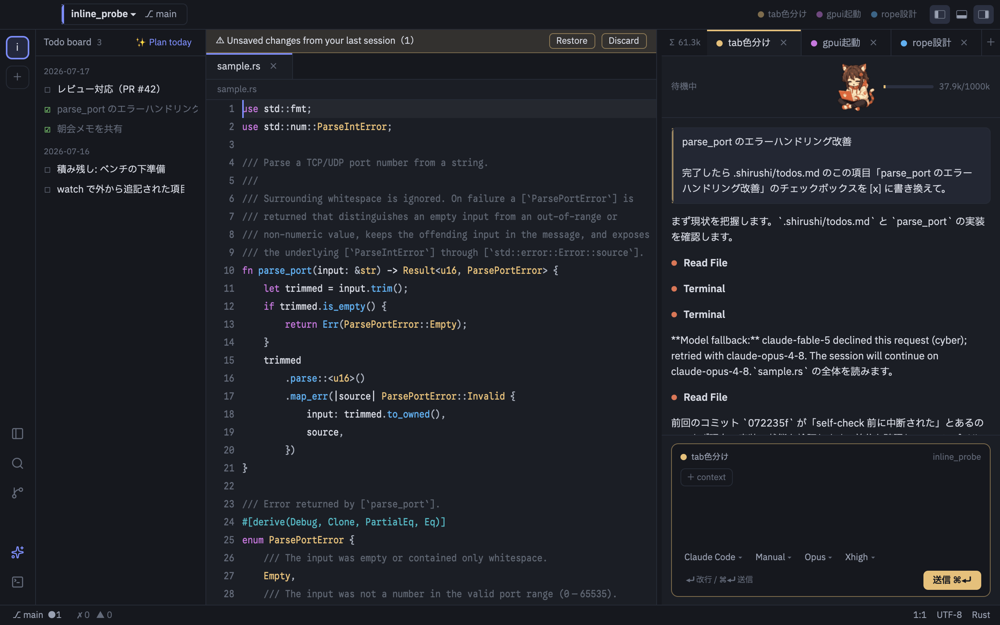

# necoder

**Orient by color.** A GPUI-native code editor for the agent era.

Every project and branch carries an identity color that runs through the rail, tabs, caret and AI threads — so when you juggle many repositories, worktrees and parallel agents, you always know *where you are* and *what is running where*.



## Highlights

- **Color as a sense of direction** — per-project colors (auto-assigned or picked, `.necoder/settings.json`) flow through the rail, tab underline, caret and thread chips. Color is used for *identity only*, never decoration.
- **Across projects and branches** — worktree-first windows, `⌘O` dashboard listing every project, `⎇ branch`, dirty state and running agents at a glance; tear a rail item off into its own window.
- **AI-agent native (ACP)** — Claude Code and other [ACP](https://agentclientprotocol.com) agents run inside: colored threads with destination chips, an always-visible token meter, streaming transcripts (⏺/⎿, ✳ thinking), diff review with accept/reject, checkpoints/rewind, a todo board the agent checks off by itself, and a fleet view for parallel agents with a coordinator. Uses your existing Claude Code subscription via the `claude` CLI — **no separate API key**.
- **Fast and small** — native GPUI (no Electron, no webview). Dev measurements: cold start ~215ms, idle RSS ~120MB, editor-core ops ~1µs (guarded in CI).
- **Remote SSH** — the same editor over `ssh://`, backed by a ~2.4MB static musl server (idle RSS 6.5MB, no node on either side). Uses your system OpenSSH config, keys and ProxyJump as-is.
- **Editor table stakes** — LSP (diagnostics, completion, hover, rename, code actions, references, formatting), tree-sitter highlighting for Rust/TS/TSX/JS/Python/Go/JSON/YAML/TOML/HTML/CSS with incremental parsing, Git (status colors, gutter diff, hunk stage/revert, blame, diff tabs, branch/worktree menu), integrated terminal with file:line links, project-wide search, multi-cursor, soft wrap, Japanese IME, hot exit.
- **Japanese / English UI** (follows your OS locale), theme skinning with live preview, **no telemetry — ever**. The only network calls are the ones you initiate (your agents, your SSH hosts) plus a version check against GitHub Releases.

## Install (macOS)

1. Download the latest `necoder.dmg` from [Releases](https://github.com/iKora128/necoder/releases) and drag **necoder** into **Applications**.
2. Requires **macOS 13+ (Apple Silicon)**. Builds are codesigned and notarized; the app self-updates from Releases (verifying the Apple signature before installing).
3. For AI features, install and log in to the [`claude` CLI](https://docs.anthropic.com/en/docs/claude-code) — necoder talks to it over ACP.

Something broke? In-app **Help → Report a Bug** pre-fills an issue. Logs live in `~/Library/Application Support/necoder/logs/` (written when launched from Finder/Dock) and crash reports in `…/necoder/crashes/`.

## Build from source

```sh
git clone https://github.com/iKora128/necoder.git && cd necoder
cargo run -p necoder          # toolchain pinned by rust-toolchain.toml (rustup fetches it)
./scripts/bundle-mac.sh        # optional: assemble necoder.app with the app icon
```

The first build compiles GPUI and takes a while. Without full Xcode (Command Line Tools only), `bundle-mac.sh` automatically falls back to runtime shader compilation.

## First 10 minutes

| Key | Action |
|---|---|
| `⌘O` | Open a project / worktree (dashboard) |
| `⌘P` / `⇧⌘P` | File finder / command palette |
| `⇧⌘A` | New AI thread (needs `claude` CLI) |
| `⌘J` | Integrated terminal |
| `⇧⌘F` | Project-wide search |
| `⌘⇧T` | Theme selector (live preview) |

## Remote SSH

Uses system OpenSSH (config, known_hosts, ssh-agent, ProxyJump) as-is. Point necoder at an SSH URI, or browse from the launcher (`＋` → SSH):

```sh
cargo build -p host --bin necoder-remote-server   # dev builds: build the server first
cargo run -p necoder -- 'ssh://user@example.com:22/home/user/project'
```

The matching server binary is deployed automatically (same-target sibling binary, or a bundled musl artifact; checksum-verified, old versions cleaned up). Reconnection re-subscribes watches and re-spawns LSP/PTY handles; unsaved-buffer backups are host-scoped. Remaining gaps: GUI askpass (key/agent auth is assumed) and long-haul testing on a physical Linux host — see [`docs/research/remote-ssh-2026.md`](docs/research/remote-ssh-2026.md).

To exercise the complete SSH path without a separate machine, run:

```sh
./scripts/test-remote-ssh-docker.sh
```

This starts an isolated Ubuntu/OpenSSH container, creates a disposable key and
`known_hosts`, deploys the matching Linux remote server, and runs the live SSH
suite (file operations, search, commands, reconnects, watches, and resource
checks). It requires Docker and a musl remote-server artifact for the Docker
architecture; the script prints the exact `cargo zigbuild` command if one is
not available.

To try the normal GUI connection flow instead, run:

```sh
./scripts/test-remote-ssh-docker.sh --gui
```

Keep that terminal open while using the remote project. Closing necoder stops
the SSH container and removes its temporary key and network automatically. In
necoder, choose `+` → Remote/SSH → `necoder-docker`, then browse to
`work/sample` and open that folder as the project.

## Documentation

| What | Where |
|---|---|
| Milestones & acceptance criteria | [`docs/ROADMAP.md`](docs/ROADMAP.md) |
| Architecture (crates, contracts) | [`docs/ARCHITECTURE.md`](docs/ARCHITECTURE.md) |
| UI spec (tokens, color rules, keys) | [`docs/UI-SPEC.md`](docs/UI-SPEC.md) |
| Decision log (license, window model…) | [`docs/DECISIONS.md`](docs/DECISIONS.md) |
| Feature backlog | [`FEATURES.md`](FEATURES.md) |
| Editor research (VSCode/Zed/Cursor) | [`docs/research/`](docs/research/) |
| Agent working guide (this repo is built with agents) | [`CLAUDE.md`](CLAUDE.md) |

Development docs are primarily in Japanese; the UI is fully bilingual (ja/en).

## License & contributing

- **AGPL-3.0-or-later** ([LICENSE](LICENSE)). All code is original or built on permissive dependencies (GPUI is Apache-2.0). **No GPL code is ported from other editors** — techniques are studied, implementations are our own, and CI enforces a dependency license audit ([cargo-deny](deny.toml)). Rationale and history: [`docs/DECISIONS.md`](docs/DECISIONS.md) §5.
- Contributions are welcome — read [`CONTRIBUTING.md`](CONTRIBUTING.md) first. **All contributions require signing the [CLA](CLA.md)** (a bot guides you on your first PR); this keeps future licensing options (including dual licensing) with the maintainer.
- Bundled fonts are OFL-1.1 ([`assets/fonts/`](assets/fonts/README.md)); icons are Lucide (ISC) and Simple Icons (CC0) ([`crates/necoder/assets/icons/LICENSE.md`](crates/necoder/assets/icons/LICENSE.md)).

---

## 日本語

自作エディタ **necoder（ねこーだー）**。「**色による方向感覚**」×「**プロジェクト/ブランチ横断**」×「**AI エージェントネイティブ（ACP）**」の交点を狙う、GPUI ネイティブのコードエディタです。

- プロジェクト/ブランチごとの識別色がレール・タブ・キャレット・AI スレッドまで貫通し、並行作業でも「今どこで・何が走っているか」を見失わない
- Claude Code が中で動く（既存サブスクのまま・API キー不要）: 色付きスレッド、トークン常時表示、diff レビュー、チェックポイント、Todo ボード、複数エージェントの編隊ビュー
- Remote SSH・LSP・tree-sitter 多言語・Git（hunk stage / blame / worktree）・統合ターミナル・日本語 IME・hot exit
- **テレメトリなし**。通信は自分で起動するもの（エージェント・SSH）と GitHub Releases への更新チェックのみ

**インストール**: [Releases](https://github.com/iKora128/necoder/releases) から `necoder.dmg` を取得して Applications へ（macOS 13+ / Apple Silicon・署名/公証済み・アプリ内自動更新）。AI 機能には `claude` CLI のログインが必要です。

**ソースから**: `cargo run -p necoder`（toolchain は `rust-toolchain.toml` で固定）。`./scripts/bundle-mac.sh` で .app を組み立て。

**開発に参加する**: [`CONTRIBUTING.md`](CONTRIBUTING.md) を参照。全てのコントリビュートに [CLA](CLA.md) への署名が必要です（初回 PR で bot が案内）。Zed の GPL crate からのコード移植は禁止（手法の参考のみ・[`docs/DECISIONS.md`](docs/DECISIONS.md) §5）。

リポジトリ構成の詳細は [`docs/ARCHITECTURE.md`](docs/ARCHITECTURE.md) を参照（`crates/` に約 20 crate・`zed/` は git 管理外の参照用クローン・`mock/` はビジュアルモック）。
