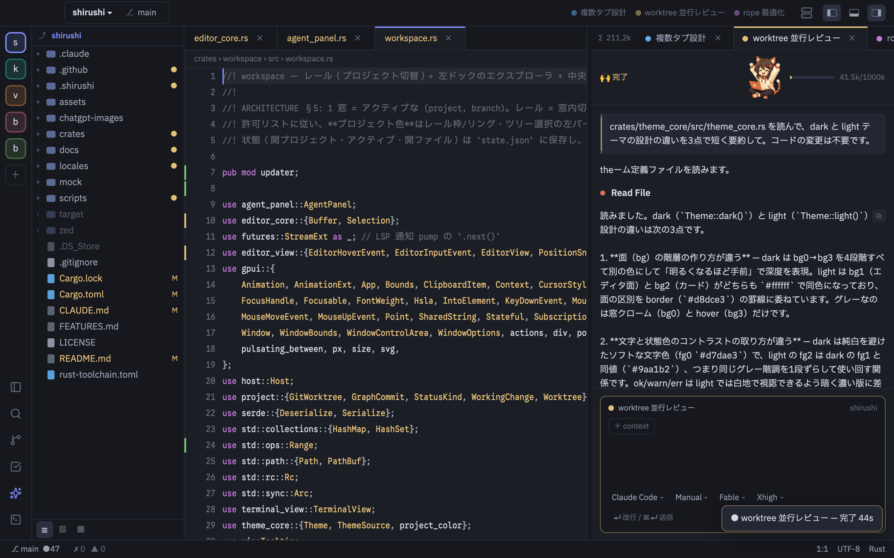
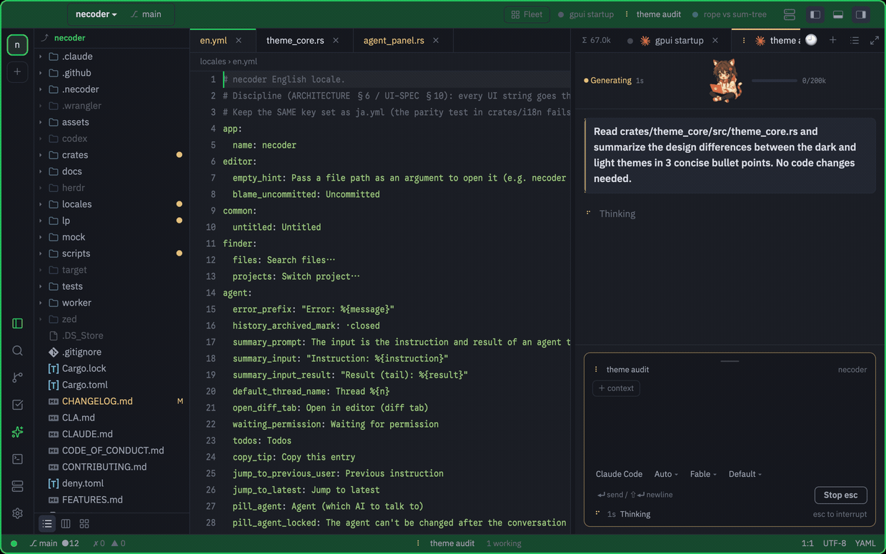
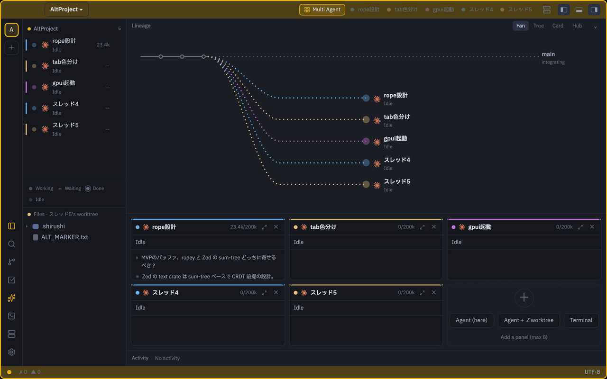
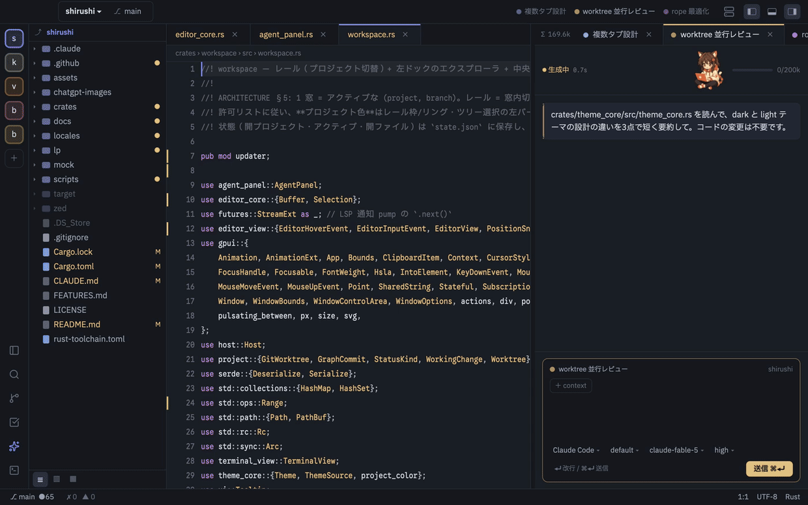

<div align="center">


# necoder

**Orient by color.** A GPUI-native code editor for the agent era.

[](https://github.com/iKora128/necoder/releases)
[](https://github.com/iKora128/necoder/actions/workflows/ci.yml)
[](LICENSE)


[**Download**](https://github.com/iKora128/necoder/releases) · [**Website**](https://necoder.com/en/) · [**日本語**](#日本語)

</div>



## Why another editor?

necoder was born from a very concrete frustration: **running AI coding agents all day across many repositories, branches and worktrees — and constantly getting lost.**

- **"Which thread is talking to which project?"** Agent chats all look the same. One mistargeted prompt to the wrong branch can cost you an afternoon.
- **Token usage was invisible** until the context silently compacted mid-task.
- **No existing editor could fix it.** What we wanted was *color as identity* — and that turned out to be structurally impossible to add from the outside: Zed extensions cannot render UI at all, VSCode's UI flexibility comes bundled with webview weight. ([Full background / research notes](docs/BACKGROUND.md))

So necoder makes the things agent-heavy development actually needs **first-class in the editor core**:

1. **Identity** — every project/branch carries a color that runs through the rail, tabs, caret and AI threads. You always know *where you are*.
2. **Glanceable state** — destination chips (thread → project ⎇ branch), an always-visible token meter, and a fleet view for parallel agents. You always know *what is running where*.
3. **Native speed** — GPUI, no Electron, no webview. The editor stays out of your way.

## Highlights

- **Color as a sense of direction** — per-project colors (auto-assigned or picked) flow through the rail, tab underline, caret and thread chips. Color is used for *identity only*, never decoration.
- **AI-agent native (ACP)** — Claude Code and other [ACP](https://agentclientprotocol.com) agents run inside: colored threads with destination chips, streaming transcripts (⏺/⎿, ✳ thinking), diff review with accept/reject, checkpoints/rewind, and a todo board the agent checks off by itself. Uses your existing Claude Code subscription via the `claude` CLI — **no separate API key**.

  

- **Fleet view for parallel agents** — run several agents side by side with a coordinator, and see every thread's state at a glance.

  

- **Across projects and branches** — worktree-first windows, a `⌘O` dashboard listing every project with `⎇ branch`, dirty state and running agents; tear a rail item off into its own window.
- **Fast and small** — native GPUI. Dev measurements: cold start ~215ms, idle RSS ~120MB, editor-core ops ~1µs (guarded in CI).
- **Remote SSH** — the same editor over `ssh://`, backed by a ~2.4MB static musl server (idle RSS 6.5MB, no node on either side). Uses your system OpenSSH config, keys and ProxyJump as-is.
- **Editor table stakes** — LSP (diagnostics, completion, hover, rename, code actions, references, formatting), tree-sitter highlighting (Rust/TS/TSX/JS/Python/Go/JSON/YAML/TOML/HTML/CSS) with incremental parsing, Git (status colors, gutter diff, hunk stage/revert, blame, diff tabs, branch/worktree menu), integrated terminal with `file:line` links, project-wide search, multi-cursor, soft wrap, Japanese IME, hot exit.
- **Japanese / English UI** (follows your OS locale), theme skinning with live preview, **no telemetry — ever**. The only network calls are the ones you initiate (your agents, your SSH hosts) plus a version check against GitHub Releases.

## Install

**macOS 13+ (Apple Silicon)** — download `necoder.dmg` from [Releases](https://github.com/iKora128/necoder/releases) and drag **necoder** into **Applications**. Builds are codesigned and notarized; the app self-updates from Releases (verifying the Apple signature before installing).

**Windows 10+ (x64)** — download `necoder-windows-x64.zip` from [Releases](https://github.com/iKora128/necoder/releases), unzip, run `necoder.exe`. The app notifies you of new versions and opens the release page.

For AI features, install and log in to the [`claude` CLI](https://docs.anthropic.com/en/docs/claude-code) — necoder talks to it over ACP.

Something broke? In-app **Help → Report a Bug** pre-fills an issue. Logs live in `~/Library/Application Support/necoder/logs/`, crash reports in `…/necoder/crashes/`.

## First 10 minutes

| Key | Action |
|---|---|
| `⌘O` | Open a project / worktree (dashboard) |
| `⌘P` / `⇧⌘P` | File finder / command palette |
| `⇧⌘A` | New AI thread (needs `claude` CLI) |
| `⌘J` | Integrated terminal |
| `⇧⌘F` | Project-wide search |
| `⌘⇧T` | Theme selector (live preview) |

## Build from source

```sh
git clone https://github.com/iKora128/necoder.git && cd necoder
cargo run -p necoder          # toolchain pinned by rust-toolchain.toml (rustup fetches it)
./scripts/bundle-mac.sh        # optional: assemble necoder.app with the app icon
```

The first build compiles GPUI and takes a while. Without full Xcode (Command Line Tools only), `bundle-mac.sh` automatically falls back to runtime shader compilation.

## Remote SSH

Point necoder at an SSH URI, or browse from the launcher (`＋` → SSH). System OpenSSH (config, known_hosts, ssh-agent, ProxyJump) is used as-is; the matching server binary is deployed automatically and checksum-verified.

```sh
cargo run -p necoder -- 'ssh://user@example.com:22/home/user/project'
```

To exercise the complete SSH path locally, `./scripts/test-remote-ssh-docker.sh` spins up a disposable Ubuntu/OpenSSH container and runs the live suite (add `--gui` to try the interactive connection flow). Details and remaining gaps: [`docs/research/remote-ssh-2026.md`](docs/research/remote-ssh-2026.md).

## Documentation

| What | Where |
|---|---|
| Milestones & acceptance criteria | [`docs/ROADMAP.md`](docs/ROADMAP.md) |
| Architecture (crates, contracts) | [`docs/ARCHITECTURE.md`](docs/ARCHITECTURE.md) |
| UI spec (tokens, color rules, keys) | [`docs/UI-SPEC.md`](docs/UI-SPEC.md) |
| Decision log (license, window model…) | [`docs/DECISIONS.md`](docs/DECISIONS.md) |
| Feature backlog | [`FEATURES.md`](FEATURES.md) |
| Editor research (VSCode/Zed/Cursor) | [`docs/research/`](docs/research/) |
| Agent working guide (this repo is built with agents) | [`CLAUDE.md`](CLAUDE.md) |

Development docs are primarily in Japanese; the UI is fully bilingual (ja/en).

## License & contributing

- **AGPL-3.0-or-later** ([LICENSE](LICENSE)). All code is original or built on permissive dependencies (GPUI is Apache-2.0). **No GPL code is ported from other editors** — techniques are studied, implementations are our own, and CI enforces a dependency license audit ([cargo-deny](deny.toml)). Rationale and history: [`docs/DECISIONS.md`](docs/DECISIONS.md) §5.
- Contributions are welcome — read [`CONTRIBUTING.md`](CONTRIBUTING.md) first. **All contributions require signing the [CLA](CLA.md)** (a bot guides you on your first PR); this keeps future licensing options (including dual licensing) with the maintainer.
- Bundled fonts are OFL-1.1 ([`assets/fonts/`](assets/fonts/README.md)); icons are Lucide (ISC) and Simple Icons (CC0) ([`crates/necoder/assets/icons/LICENSE.md`](crates/necoder/assets/icons/LICENSE.md)).

---

# 日本語

<div align="center">

**色による方向感覚。** エージェント時代のための GPUI ネイティブなコードエディタ。

[**ダウンロード**](https://github.com/iKora128/necoder/releases) · [**Web サイト**](https://necoder.com/) · [**English**](#necoder)

</div>

## なぜ作ったか

necoder の出発点はとても具体的な不満です — **複数のリポジトリ・ブランチ・worktree をまたいで一日中 AI エージェントを走らせていると、必ず迷子になる。**

- **「このスレッド、どのプロジェクトと話してるんだっけ？」** エージェントのチャットは全部同じ顔。宛先を間違えた指示ひとつで午後が溶ける
- **トークン消費が見えない**。気づいたら文脈が勝手に圧縮されている
- **既存エディタでは直せなかった**。欲しかったのは「色 = アイデンティティ」。しかしこれは外から足せる機能ではない — Zed の拡張は UI を一切描けず、VSCode の UI 柔軟性は webview の重さとセット。([調査の全記録](docs/BACKGROUND.md))

だから necoder は、エージェント中心の開発が本当に必要とするものを**エディタのコアで**一級市民にしました:

1. **アイデンティティ** — プロジェクト/ブランチごとの識別色がレール・タブ・キャレット・AI スレッドまで貫通。「今どこにいるか」を見失わない
2. **一目で分かる状態** — 宛先チップ(スレッド → プロジェクト ⎇ ブランチ)、トークン常時表示、並行エージェントの編隊ビュー。「どこで何が走っているか」を見失わない
3. **ネイティブの速さ** — GPUI。Electron も webview も無し。エディタが邪魔をしない

## ハイライト

- **色による方向感覚** — プロジェクトごとの識別色(自動割当 or 選択)がレール・タブ下線・キャレット・スレッドチップまで流れる。色は**識別のためだけ**に使い、装飾には使わない
- **AI エージェントネイティブ(ACP)** — Claude Code ほか [ACP](https://agentclientprotocol.com) エージェントが中で動く: 色付きスレッド + 宛先チップ、ストリーミング表示(⏺/⎿、✳ thinking)、diff レビュー(accept/reject)、チェックポイント/巻き戻し、エージェントが自分で消す Todo ボード。既存の Claude Code サブスクのまま `claude` CLI 経由 — **API キー不要**

  

- **並行エージェントの編隊ビュー** — 複数エージェントをコーディネータ付きで並走させ、全スレッドの状態を一覧

  

- **プロジェクト/ブランチ横断** — worktree ファーストのウィンドウ、全プロジェクトを `⎇ ブランチ`・dirty・稼働エージェント付きで一覧する `⌘O` ダッシュボード、レール項目の別窓への切り離し
- **速くて小さい** — ネイティブ GPUI。実測: 起動 ~215ms / idle RSS ~120MB / 編集コア操作 ~1µs(CI でガード)
- **Remote SSH** — 同じエディタが `ssh://` 越しに動く。サーバは ~2.4MB の静的 musl バイナリ(idle RSS 6.5MB・両側 node 不要)。システムの OpenSSH 設定・鍵・ProxyJump をそのまま使う
- **エディタの基本機能** — LSP(診断・補完・hover・rename・code actions・参照・整形)、tree-sitter ハイライト(Rust/TS/TSX/JS/Python/Go/JSON/YAML/TOML/HTML/CSS・インクリメンタル)、Git(ステータス色・ガター diff・hunk stage/revert・blame・diff タブ・ブランチ/worktree メニュー)、`file:line` リンク付き統合ターミナル、プロジェクト全体検索、マルチカーソル、折り返し、日本語 IME、hot exit
- **日本語/英語 UI**(OS ロケール追従)、ライブプレビュー付きテーマ切替、**テレメトリなし**。通信は自分で起動するもの(エージェント・SSH)と GitHub Releases への更新チェックのみ

## インストール

**macOS 13+(Apple Silicon)** — [Releases](https://github.com/iKora128/necoder/releases) から `necoder.dmg` を取得して **necoder** を Applications へ。署名/公証済み・アプリ内自動更新(適用前に Apple 署名を検証)。

**Windows 10+(x64)** — [Releases](https://github.com/iKora128/necoder/releases) から `necoder-windows-x64.zip` を展開して `necoder.exe` を実行。新版はアプリ内通知からリリースページを開きます。

AI 機能には [`claude` CLI](https://docs.anthropic.com/en/docs/claude-code) のインストールとログインが必要です(necoder は ACP で対話します)。

困ったら、アプリ内 **ヘルプ → バグを報告** で issue の下書きが作られます。ログは `~/Library/Application Support/necoder/logs/`、クラッシュレポートは `…/necoder/crashes/`。

## 最初の10分

| キー | 動作 |
|---|---|
| `⌘O` | プロジェクト / worktree を開く(ダッシュボード) |
| `⌘P` / `⇧⌘P` | ファイルファインダ / コマンドパレット |
| `⇧⌘A` | 新しい AI スレッド(`claude` CLI が必要) |
| `⌘J` | 統合ターミナル |
| `⇧⌘F` | プロジェクト全体検索 |
| `⌘⇧T` | テーマセレクタ(ライブプレビュー) |

## ソースからビルド

```sh
git clone https://github.com/iKora128/necoder.git && cd necoder
cargo run -p necoder          # toolchain は rust-toolchain.toml で固定(rustup が自動取得)
./scripts/bundle-mac.sh        # 任意: アイコン付きの necoder.app を組み立て
```

初回ビルドは GPUI のコンパイルで時間がかかります。フル Xcode が無い環境(CLT のみ)では `bundle-mac.sh` が自動でランタイムシェーダにフォールバックします。

## Remote SSH

SSH URI を渡すか、ランチャー(`＋` → SSH)から辿ります。システムの OpenSSH(config・known_hosts・ssh-agent・ProxyJump)をそのまま使用し、対応するサーババイナリは自動デプロイ(チェックサム検証付き)。

```sh
cargo run -p necoder -- 'ssh://user@example.com:22/home/user/project'
```

SSH 経路全体をローカルで試すには `./scripts/test-remote-ssh-docker.sh`(使い捨ての Ubuntu/OpenSSH コンテナで実スイートを実行。`--gui` で対話フローも試せます)。詳細と残課題: [`docs/research/remote-ssh-2026.md`](docs/research/remote-ssh-2026.md)。

## ドキュメント

| 何 | どこ |
|---|---|
| マイルストーンと受入条件 | [`docs/ROADMAP.md`](docs/ROADMAP.md) |
| アーキテクチャ(crate 構成・契約) | [`docs/ARCHITECTURE.md`](docs/ARCHITECTURE.md) |
| UI 仕様(トークン・色のルール・キー表) | [`docs/UI-SPEC.md`](docs/UI-SPEC.md) |
| 設計判断ログ(ライセンス・ウィンドウモデル…) | [`docs/DECISIONS.md`](docs/DECISIONS.md) |
| 機能バックログ | [`FEATURES.md`](FEATURES.md) |
| エディタ調査(VSCode/Zed/Cursor) | [`docs/research/`](docs/research/) |
| エージェント作業ガイド(このリポジトリはエージェントと作られています) | [`CLAUDE.md`](CLAUDE.md) |

開発ドキュメントは主に日本語です。UI は日英完全対応。

## ライセンスとコントリビュート

- **AGPL-3.0-or-later**([LICENSE](LICENSE))。全コードは自作、または permissive な依存(GPUI は Apache-2.0)の上に書かれています。**他エディタからの GPL コード移植はありません** — 手法を学び、実装は自前。CI が依存ライセンスを監査します([cargo-deny](deny.toml))。経緯: [`docs/DECISIONS.md`](docs/DECISIONS.md) §5
- コントリビュート歓迎 — まず [`CONTRIBUTING.md`](CONTRIBUTING.md) をお読みください。**全てのコントリビュートに [CLA](CLA.md) への署名が必要**です(初回 PR で bot が案内)。将来のライセンス選択肢(デュアルライセンス含む)をメンテナに残すためです
- 同梱フォントは OFL-1.1([`assets/fonts/`](assets/fonts/README.md))、アイコンは Lucide(ISC)と Simple Icons(CC0)([`crates/necoder/assets/icons/LICENSE.md`](crates/necoder/assets/icons/LICENSE.md))
