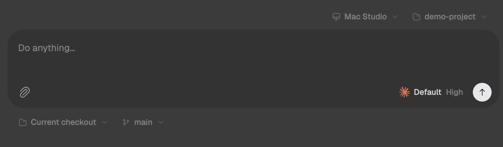
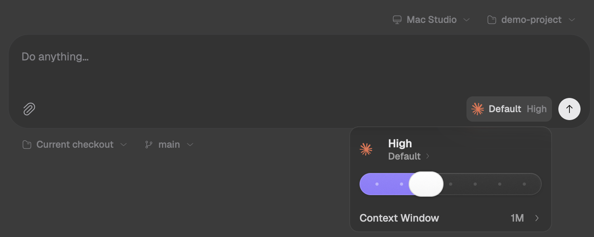
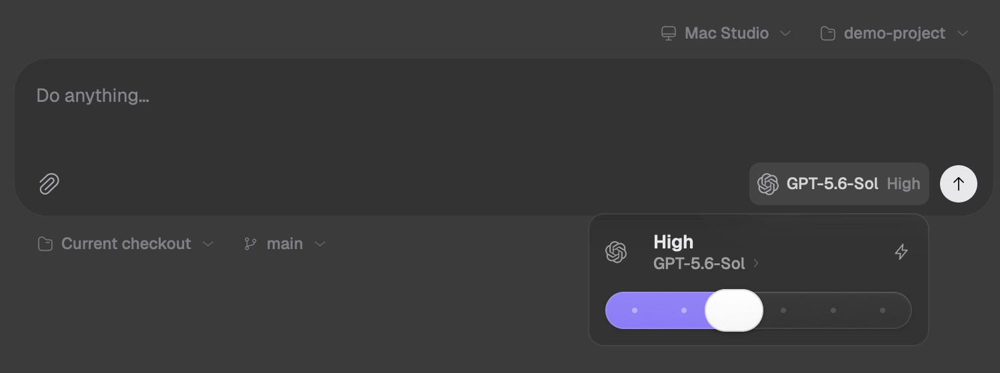
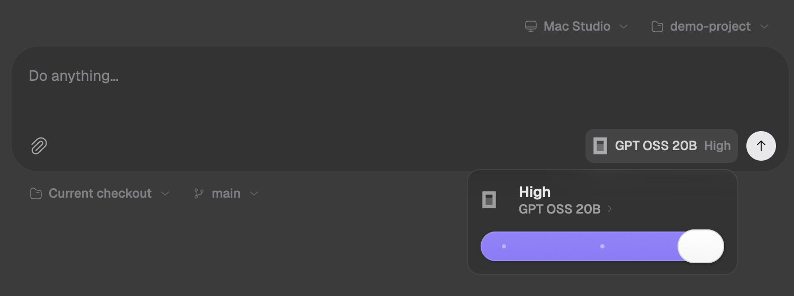
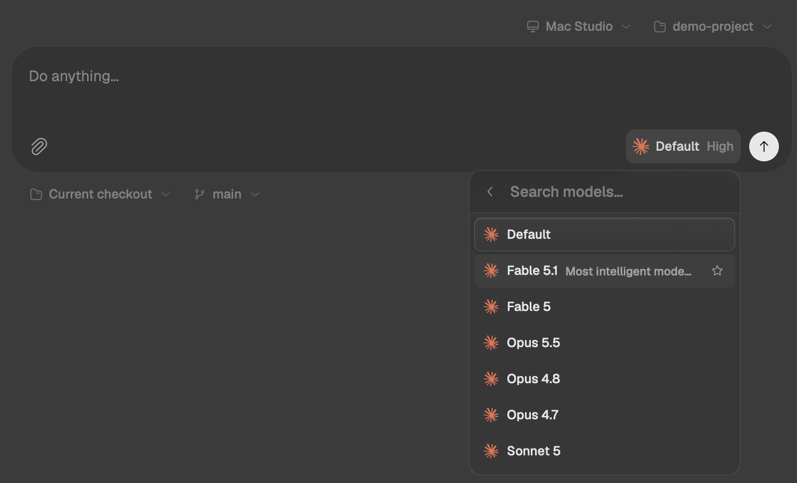
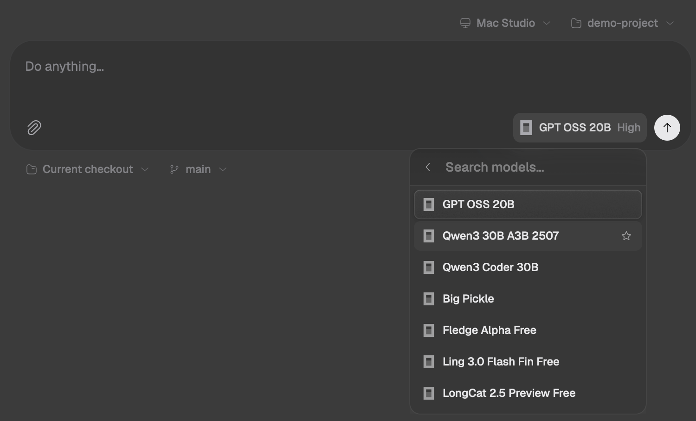
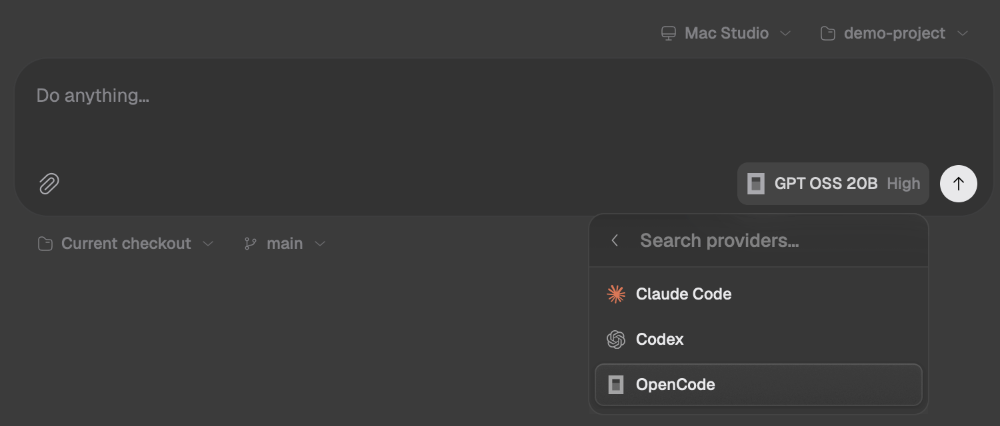
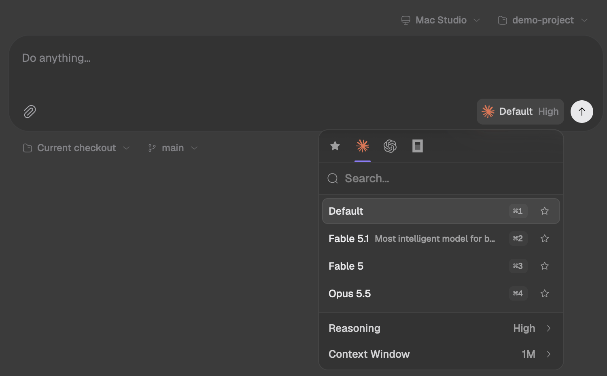
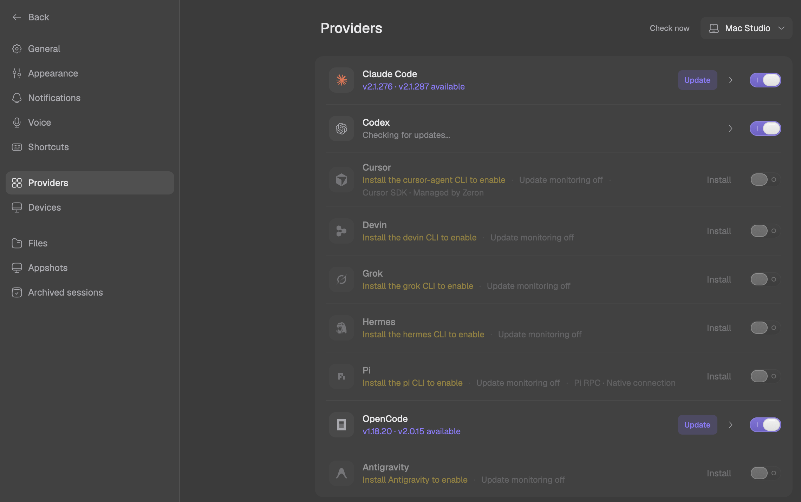
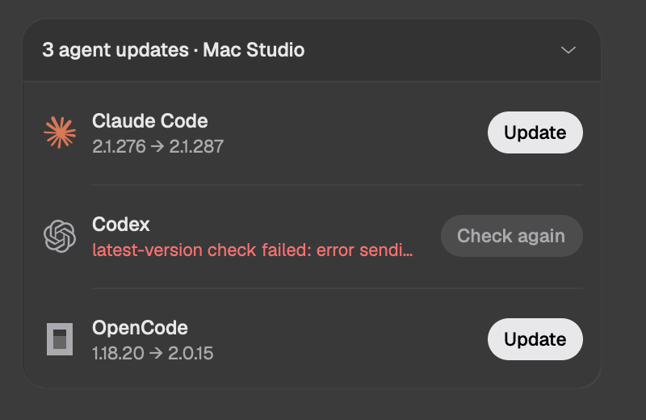

# zeron のハーネス管理と、necoder に取り入れる候補（2026-10-02）

2026-10-02 に調べた。対象は [zeron](https://github.com/zeronsh/zeron) の main `80b946b`（v0.2.101 相当）。複数のコーディングエージェントを 1 つのアプリで扱う GUI で、GPUI で書かれていて、ライセンスは MIT。ソースから組み、データを使い捨てのディレクトリに隔離して起動し、窓を出さずに撮った。手元の Claude Code、Codex、OpenCode が検出された状態で、プロンプトは送っていない。画像の端末名は、名前の部分を消して詰めてある。

ハーネスと接続の設計の正は [issue #38](https://github.com/iKora128/necoder/issues/38)（以下 #38）。各候補の「判断」は、2026-10-02 に本人が決めたこと。necoder のコードの行番号は、調査した時の main（`65f68ed`）の物。

> **結論。** zeron がハーネスを扱う場所は 2 つある。入力欄のチップから開く 1 枚のカード（エージェント、モデル、思考量、Fast、コンテキスト）と、設定の Providers 画面（端末ごとの導入、更新、有効化、アカウント）だ。#38 の「接続」（API キー・ベース URL）に当たる機能は無く、各 CLI の設定に任せている。
>
> necoder に一番効くのは、調べる途中で見つかった 2 点だ。necoder が今使っているアダプタ（claude-agent-acp）は、`providers/set`（接続の差し替え）と `_session/steering`（実行中のターンへの差し込み）をすでに持っている。`providers/set` を使えば、#38 H3 の接続を環境変数を使わずに渡せる。

**判断の一覧（2026-10-02・本人）**。「その後」は、2026-10-05 の統合（[#54](https://github.com/iKora128/necoder/pull/54)）までに main へ入った物。

| 候補 | 判断 | その後 |
|---|---|---|
| 実行中のターンへの差し込み（steer） | 入れる | [#44](https://github.com/iKora128/necoder/pull/44) で入った |
| ピッカーを 1 枚のカードにする | 入れる。見た目は本人が迷っているので mock で決める | `mock/config-card.html` の C-1 に決め（10-02）、[#48](https://github.com/iKora128/necoder/pull/48) で入った |
| #38 H3 の接続を `providers/set` で渡す | 入れる | [#47](https://github.com/iKora128/necoder/pull/47) で入った |
| Providers 画面の型 | 入れる | [#46](https://github.com/iKora128/necoder/pull/46) で入った |
| モデル一覧のキャッシュを認証の文脈で分ける | 入れる（H3 と一緒に） | [#47](https://github.com/iKora128/necoder/pull/47) の「在庫の鍵」で入った |
| ツールの全自動許可 | 「全然あり」。O16「聞かずに進める（Yolo）」が既にあるので、真似しないものから外した | 作る物は無い |
| 他アプリの認証情報の書き換え | 迷っている。#38 §5-3 の方針のまま保留 | — |
| ACP をやめる | 迷っている。Captain の推しは「やめない。Pi と DeepSeek Harness のアダプタでターンが閉じるかを実測してから見直す」 | [#45](https://github.com/iKora128/necoder/pull/45) で実測した。ふつうに使う分にはターンが閉じた |

## 1. どこで、どういう UI でハーネスをやりくりしているか

### ① 新規セッション画面：入力欄の右にチップが 1 つ

入力欄の上に「端末 ▾」と「プロジェクト ▾」、中に **[エージェントのマーク・モデル・思考量]** のチップ（思考量は既定なら薄い字、Fast が入っていれば ⚡）、下に「チェックアウト（今の作業ツリー / 新しい worktree）▾」と「ブランチ ▾」が並ぶ。チップはクリック、`⌘/`、`/model` のどれでも開く。

### ② コンパクトカード（既定）：エージェントごとに中身が変わる

Claude Code のカード。大きな字が思考量（High）で、その下がモデル名（Default ›）。スライダーで思考量を選び、下の行に「Context Window 1M ›」が出る。

Tab で Codex に切り替えた所。右上に ⚡（Fast＝Codex の service tier）が出る。

もう一度 Tab を押すと OpenCode。思考量の段数もモデルに合わせて変わる（ここでは 3 段）。

- キー操作は、`Tab` でエージェントを順に切り替え、`↑↓` でモデル一覧、`←→` で思考量、`Esc` で戻る。
- カードの項目は、エージェントが伝えてきた設定から作る。思考量、Fast、コンテキスト以外の select や boolean も、そのまま行として出る（ACP なら `configOptions` 全部）。

### ③ モデル一覧と、カード内のエージェント一覧

Claude Code のモデル一覧（Claude Code が起動時に返した実際の一覧）。検索と ★ がある。★ はお気に入りで、エージェントをまたいで「Starred」にまとまる。

OpenCode の一覧。`lmstudio/…` や `opencode/…` など、OpenCode 側に設定済みの provider（necoder の言葉では接続）のモデルがそのまま並ぶ。zeron 自身は接続を持たない。

カード左上のマークを押すと、エージェントの一覧が出る（見出しは「Search providers…」）。**zeron の UI はハーネスを「provider」と呼ぶ**。ACP の `providers/*` と #38 では provider は接続の側を指すので、向きが逆になる（necoder での呼び分けは §4）。

### ④ 旧式ピッカー（設定で compact をオフにした場合）

上にエージェントのアイコンのタブ（先頭は ★）、その下に検索、モデルの行に ⌘1〜⌘9、下に「Reasoning High ›」と「Context Window 1M ›」。

### ⑤ 設定 → Providers（端末ごと）

全 9 エージェントが 1 列に並ぶ。未導入の行には「Install the X CLI to enable」と Install ボタンが出る（各社のインストーラを非対話で実行する）。導入済みの行には版と「Update」、有効 / 無効のトグル。右上で端末（同期した別マシン）を切り替える。行の › を開くと、補完の設定（`$` でスキル、`/` を分ける）、更新方針（通知 / 空いた時に自動 / オフ）、**アカウント**（複数ログインの切り替えと使用量メーター）が出る。展開すると Claude のトークンを読みに行くので、今回は開いていない。

### ⑥ エージェント CLI の更新をまとめて知らせる部品

画面下の「3 agent updates」を開いた所。6 時間おきに各 CLI の新しい版を調べ（zeron の `crates/engine/src/harness_updates.rs` の `CHECK_INTERVAL`）、その場で Update できる。

### 決まりごと

- 導入していない、または無効にしたエージェントは、ピッカーに出さない（灰色にもしない）。最後の 1 つは無効にできない。
- 会話が始まるとエージェントは固定される。モデル、思考量、オプションはいつでも変えられ、次の送信で CLI を起こし直して同じセッションを resume する。
- 前回の選択を、エージェント → エージェントごとのモデル → モデルごとの思考量・オプション・★ まで覚える（`composer-defaults.json`）。既定値を更新するのは、新規画面での選択だけ。
- ツールの権限確認は無い。すべて自動で許可する（Codex は `danger-full-access`）。
- 複数のエージェントで同じタスクを比べる UI は無い。エージェント同士は zeron の MCP でチャットを作って送り合う。

### 中身：ACP をやめてネイティブに戻した

| エージェント | つなぎ方 |
|---|---|
| Claude Code | `claude --print` の stream-json ＋ control protocol |
| Codex | `codex app-server`（JSON-RPC） |
| OpenCode | `opencode serve`（HTTP/SSE） |
| Pi | Pi の RPC モード |
| Cursor | @cursor/sdk を包む Node シム |
| Devin / Grok / Hermes / Antigravity | ACP（最初から ACP で作られたものだけ） |

zeron は 2026-08-08 に Claude Code と Codex を ACP アダプタ（claude-agent-acp / codex-acp）へ一本化し、08-17 にネイティブへ戻した（OpenCode は 08-22、Pi は 09-29）。zeron の記録によると、理由は、アダプタが裏の作業のためにターンを開いたままにし、CLI 本体なら済んでいる完了の判定を誤らせること（zeron の `docs/research/acp.md`、`crates/harness/src/lib.rs:1-15`）。necoder で「ターンが終わらない」という報告が出たら、まずここを疑う。ACP をやめるかどうかは §3 で保留にした。

## 2. necoder に取り入れる候補（効き目と手間の順）

手間は S / M で書き、#38 のどの PR に関わるかを添える。

1. **実行中のターンへの差し込み（steer）**（手間 S）

   necoder が今動かしている claude-agent-acp 0.81.2 は `_session/steering` を持っている（`dist/acp-agent.js:163`。0.84.0 と、2026-10-02 時点の最新の 0.85.0 にもある）。codex-acp 1.13.1 にも入っている。一方 necoder の「中断して今すぐ」は、ターンをキャンセルしてから送り直す作りで（`crates/agent_panel/src/agent_panel.rs` の `send_queued_now`）、途中のツール作業を捨てている。差し込みを広告している相手には差し込み、していない相手には今のままターンの後で送る。zeron のこの分け方が、そのまま使える。

   **判断（本人）：入れる。** その後、[#44](https://github.com/iKora128/necoder/pull/44) で入った。

2. **ピッカーを 1 枚のカードにし、広告された設定を全部出す**（手間 S・#38 H4）

   今の necoder がエージェントの設定から出すのは、Model と Effort だけだ。ピルはエージェント、権限モード、Model、Effort の 4 種類しか無く（`crates/agent_panel/src/agent_panel.rs:123-128` の `enum Selector`）、ほかの select には出す場所が無い。boolean は読み込みの時点で捨てている（`crates/acp_client/src/acp_client.rs:1590`「Boolean は今は UI で扱わない」）。このため Claude の Fast モードを出せない。チップには既定から外れた値だけを要約して出し（例えば High · 1M · ⚡）、Tab でエージェントを、←→ で思考量を変える。H4 の「ハーネス × 接続 × モデル」のチップも、この形に載せればよい。

   **判断（本人）：入れる。見た目は本人が迷っているので、mock で決める。** その後、同じ日に `mock/config-card.html` の C-1（権限モードだけカードの外のピルに残す）に決め、[#48](https://github.com/iKora128/necoder/pull/48) で「設定のカード」として入った。

3. **#38 H3 の接続を ACP の `providers/set` で渡す**（手間 M・#38 H3 / H4）

   claude-agent-acp は `providers/list|set|disable` を広告している（apiType・baseUrl・headers。0.81.2 では `dist/acp-agent.js:1122` で広告し、`:1454` が `providers/set`。0.84.0 と 0.85.0 にもある）。設定はプロセス単位で、その後に作る、または読み込むセッションに効く。Claude Code に GLM などをつなぐ時、環境変数を入れて起こし直す代わりに、`providers/set` → `session/load` で済む。広告していないハーネスには、今までどおり環境変数で渡す。

   necoder が使う `agent-client-protocol` 1.3.0 は、このメソッドを有効にする Cargo の feature を出していない（型はスキーマ 1.4.0 の `unstable_llm_providers` の裏にある）。送るなら独自のリクエストにするか、クレートの更新を待つ。

   **判断（本人）：入れる。** その後、[#47](https://github.com/iKora128/necoder/pull/47) で接続として入った（`providers/set` を広告する Claude Code のアダプタには送り、ほかは起動時の環境変数。GLOSSARY の「渡し方」）。

4. **Providers 画面の型**（手間 S〜M・#38 H2）

   necoder にはもう、レジストリと、足したエージェントと、binary / uvx の配備がある（`crates/acp_client/src/{registry,custom,deploy}.rs`、`crates/settings/src/add_agent.rs`）。足すなら見せ方だ。全エージェントを 1 列に並べ、行ごとに導入の状態、版、有効化を出し、ホスト（necoder なら SSH 先）で切り替える。CLI 本体の更新通知は、アダプタをレジストリの版に自動で合わせている necoder では優先度が低い。

   **判断（本人）：入れる。** その後、[#46](https://github.com/iKora128/necoder/pull/46) で入った（設定 › AI エージェントの 1 列の一覧。導入の状態・版・使う / 使わない）。

5. **モデル一覧のキャッシュを「認証の文脈」で分ける**（手間 S・#38 H3）

   zeron は、実行ファイルのパス・版・更新時刻と、認証と設定のファイルと、関連する環境変数をまとめてハッシュし、それをキーに最後に取れた一覧を保存する（zeron の `crates/harness/src/model_context.rs`）。necoder は広告の在庫（`crates/agent_panel/src/agent_panel.rs` の `AgentAdvertisement`。メモリの中だけ）をエージェントの id だけで引いていて、コメントにも「広告は agent 固有でスレッド非依存」と書いてある。#38 では接続を差し替えるとモデル一覧が変わるので、鍵に接続を入れないと別の接続のモデルが出る。レート制限の値を分ける「使用量の鍵」（`agent_panel::usage::UsageKey`。エージェント + 動かしている場所 + 認証の置き場 + 認証に関わる env の指紋）が同じ考え方なので、これに接続を足した形にできる。

   **判断（本人）：入れる。H3 と一緒に。** その後、[#47](https://github.com/iKora128/necoder/pull/47) の「在庫の鍵」（`agent_panel::StockKey`。使用量の鍵に接続を含め、ログインの指紋を足した物）で入った。

次点は、質問パネルの数字キー操作、会話のフォーク、作業ツリーごとのプロジェクトアクション（リポジトリが提案するコマンドは、明示の同意を取ってから取り込む）。この 3 つの判断はまだ聞いていない。

**ツールの全自動許可は、真似しないものから外した。** 本人の判断は「全然あり」。necoder には O16 の「聞かずに進める（Yolo）」（設定 › AI エージェントの「権限の既定」。`agent_permission_default` = `bypass`）がすでにあり、Claude Code の `bypassPermissions`、Qwen Code の `yolo`、Codex の `full-access` を対象にしている（`crates/agent_panel/src/agent_panel.rs` の `is_bypass_mode`）。新しく作る物は無い。

## 3. 真似しないもの

- **他アプリの認証情報の書き換え。** zeron はアカウントを切り替える時、CLI の資格情報の置き場（macOS のキーチェーンの `Claude Code-credentials` と、`$CODEX_HOME/auth.json`）を、保存しておいた物で上書きする。Claude のアカウントを足す時は、Claude Code と同じ PKCE の流れを zeron 自身のループバックの受け口で回し、使用量は `/api/oauth/usage` から読む（zeron の `crates/engine/src/agent_accounts.rs`）。#38 §5-3「サブスクの OAuth はハーネスに任せる」とは向きが逆になる。necoder のアカウント（O14）は、設定の置き場のフォルダを `CLAUDE_CONFIG_DIR` / `CODEX_HOME` で指すだけで、資格情報は読まない。

  **判断（本人）：迷っている。#38 §5-3 の方針のまま保留。**

- **ACP をやめること自体。** necoder は ACP が芯だ。

  **判断（本人）：迷っている。** 本人は DeepSeek Harness と Pi を使いたい。zeron は Pi を 2026-09-29 にネイティブ（Pi の RPC）へ移した。necoder には #38 の H1 と H2 が入っているので、DeepSeek Harness はコミュニティ製の ACP アダプタ（`dsh-acp`）を足したエージェントとして、Pi は ACP レジストリの `pi-acp`（npx）として、ACP のまま載せられる。どちらも、necoder で動かした記録はまだ無い。Captain の推しは「やめない。Pi と DeepSeek Harness のアダプタでターンが閉じるかを実測してから見直す」。

  その後、[#45](https://github.com/iKora128/necoder/pull/45) で実測した（[`pi-dsh-2026-10.md`](./pi-dsh-2026-10.md)）。ふつうに使う分には、pi-acp、dsh-acp、dsh 公式の ACP のどれも、返答・ツール・取り消しのターンが最後の更新の直後に閉じた。zeron がアダプタをやめた理由の、裏の作業でターンを開いたままにする動きは出なかった。崩れたのは pi-acp が失敗した時で、モデル側のエラーが本文の無い `end_turn` になり、pi が途中で落ちるとターンが閉じない。判断は迷っているまま。

- **同期サーバとネイティブ iOS アプリ。** zeron は任意の端末間同期（Cloudflare の Workers / Durable Objects）と iOS アプリを持つ。necoder のリレーは何も保存せず、封をした（暗号化した）フレームを渡すだけなので、方向が違う。この項の判断は 2026-10-02 には聞いていない。

## 4. #38 を進める時の注意（コードで確認済み）

- **`connections` は project 層から読まない。** necoder は設定を default → user → リポジトリの `.necoder/settings.json` の順に重ねるだけだ（`crates/settings_core/src/settings_core.rs:693-713`、起動時に最初のローカルプロジェクトを渡す `crates/necoder/src/main.rs:783-787`）。H3 の `connections` を settings.json に置くと、clone したリポジトリの作者が `base_url` を差し替え、キーチェーンのキーを別の宛先へ送らせることができてしまう。今の `agent_servers`（起動コマンド）も、同じ経路で上書きできる。その後、[#47](https://github.com/iKora128/necoder/pull/47) で、接続・起動コマンド・MCP・権限の既定などを project 層から読まないようにした（`settings_core::USER_ONLY_KEYS`。GLOSSARY の「リポジトリに決めさせないキー」）。
- **呼び分け。** zeron の UI の provider は necoder のエージェント（ハーネス）にあたり、ACP の `providers/*` と #38 の接続は、そのまま necoder の接続にあたる。UI の宛先はエージェント・接続・モデル・思考量の 4 語で言い、provider / プロバイダは UI に出さない（2026-10-02 本人）。GLOSSARY の「二義に注意」と廃止語の表に載せた。
